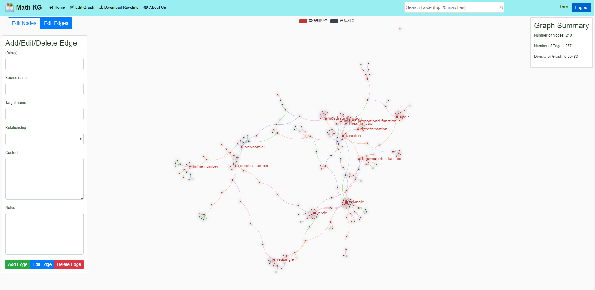
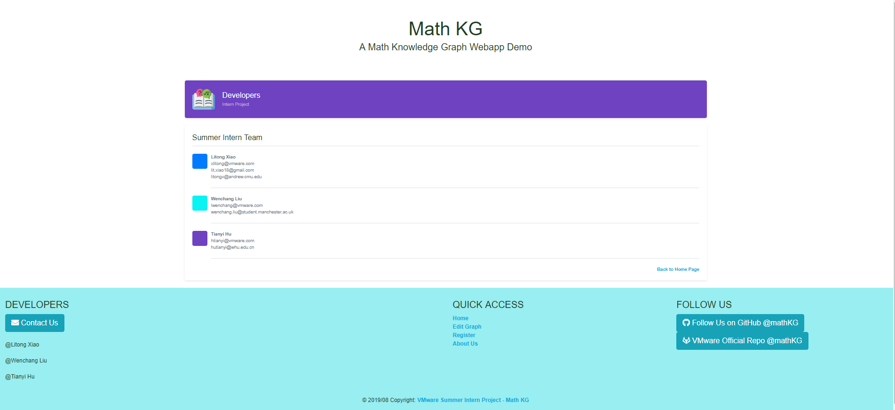

# A Data Visualization Webapp Demo
* Edit Page
    * 
* About
    * 

## Repo Url
* [GitHub](https://github.com/williamlwclwc/mathKG-webapp)
* [Official VMware GitLab](https://gitlab.eng.vmware.com/math-kg/math-kg)

## Tools

* Server-end
    * flask
    * mongodb

* Front-end
    * echarts
    * bootstrap
    * font awesome

* Deployment
    * gunicorn

## Dependencies and Virtual Environment

* First you need to install python(3.6 or above) and python virtual environment and create your own virtural environment (e.g. venv) under the project folder by typing "$ python -m venv venv".
* Activate virtual environment by: Open the project folder in terminal, type"$ source ./venv/bin/activate". You may also do this via Python Ides(e.g. pycharm) by configging the interpreter as venv and the python inside the folder.
* If you activated your virtual environment successfully, your will see "(venv)" in your command line
* Dependencies in a virtual environment can be exported: $ pip freeze > requirements.txt
* Dependencies can be installed into a virtual environment: $ pip install -r requirements.txt 

## restore our data in your mongodb
* the dump file is in `app/static/data/dump`
* use the restore command: `mongorestore app/static/data/dump`

## How to run with dev server

1. Make sure you have your virtual environment activated

2. Install dependencies into your virtual environment

3. You can run server by typing:"$ python math-server.py" and open the link "http://127.0.0.1:5000/" in your browser

4. Use "ctrl+c" to stop the server and use "$ deactivate" to quit virtual environment

## How to run with production server

1. Make sure you have your virtual environment activated

2. Install dependencies into your virtual environment

3. Run server in background: `$ gunicorn run_server:app -p run_server.pid -b "your ip":"your port" -D`

4. See the pid of your server: `$ cat run_server.pid`

5. Shutdown your server: `$ kill "pid of your server"`
